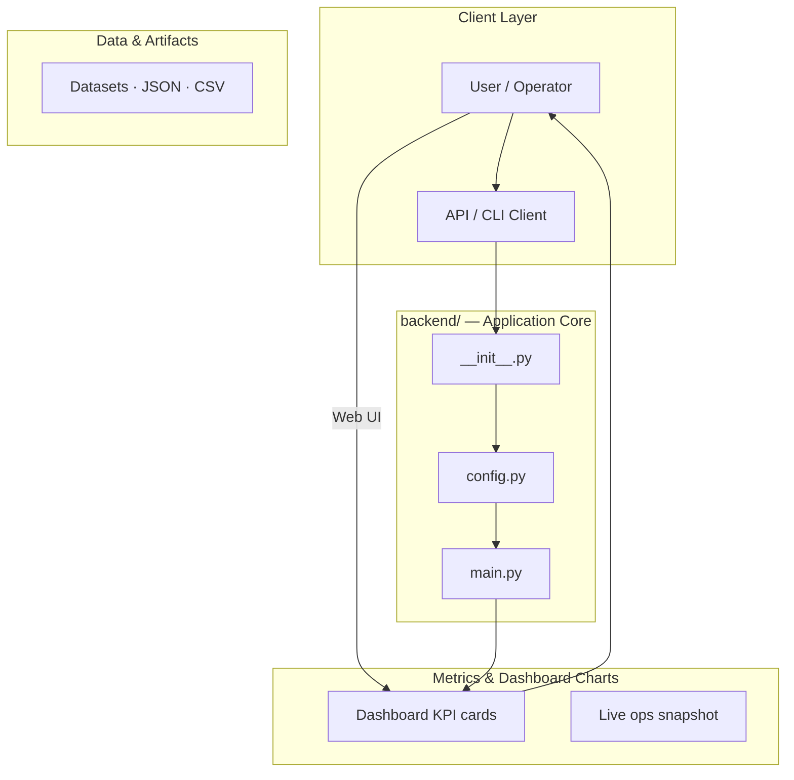
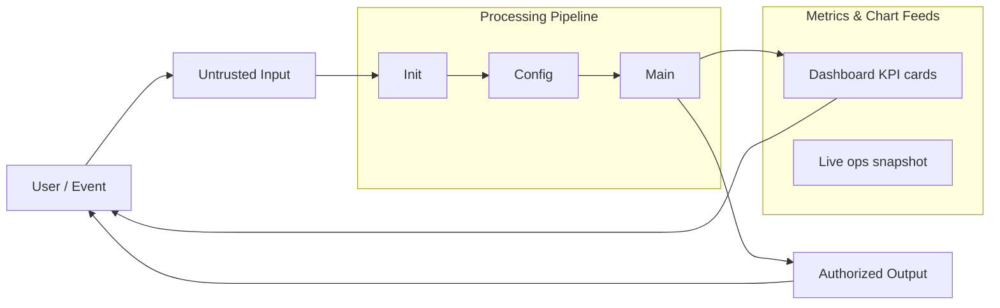
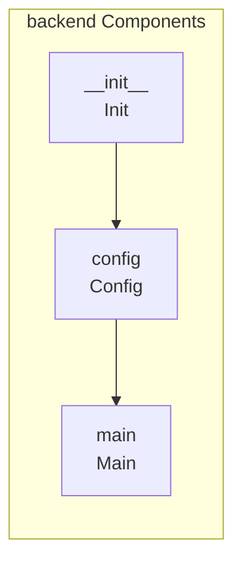
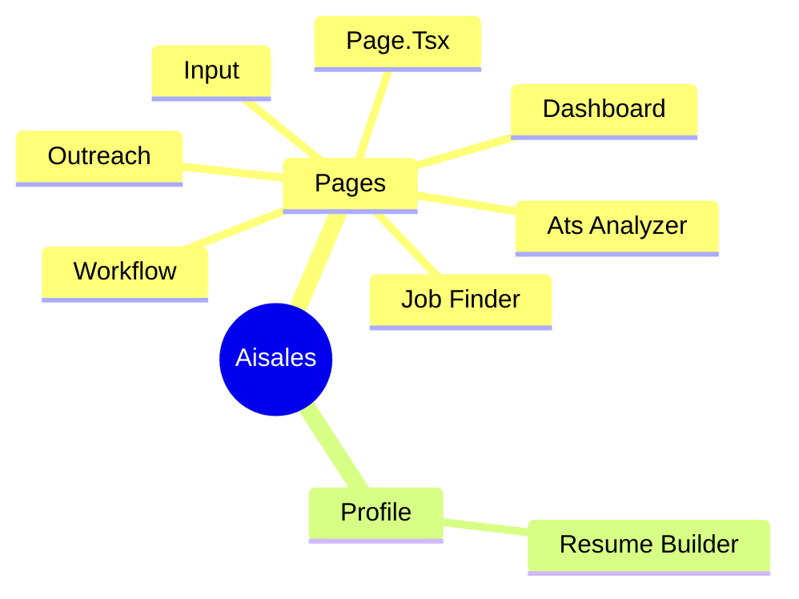

# AI Sales Platform: Comprehensive Setup and Development Guide

A full-stack application built with Next.js and FastAPI, designed to automate sales processes, manage leads, and integrate AI capabilities for sales analysis.

## Overview

This project is a sophisticated AI-powered sales platform. It consists of two main components: a Next.js frontend for the user interface and a FastAPI backend for handling business logic, database interactions, and AI model calls. The platform aims to streamline the sales cycle by providing lead management, automated content generation, and deep sales analysis.

## Problem

The need for an efficient, automated, and data-driven platform to manage the sales pipeline, generate personalized content, and analyze leads using AI, thereby reducing manual effort and increasing sales conversion rates.

## Solution

The solution is a modular, full-stack application that provides a centralized dashboard for sales teams. It uses a FastAPI backend to expose secure APIs, a Next.js frontend for a responsive UI, and integrates with external services like Supabase (for database) and Ollama (for local AI models).

## Key Features

- Lead Management Dashboard: View, filter, and manage leads.
- AI Content Generation: Generate sales emails, scripts, and content based on lead data.
- Sales Pipeline Visualization: Track leads through various stages of the sales funnel.
- CRM Functionality: Store and retrieve detailed customer and lead information.
- Authentication: Secure user login and session management.
- AI Integration: Utilizes local LLMs (via Ollama) for advanced text generation and analysis.

## Technology Stack

- Next.js
- React
- TypeScript
- Python
- FastAPI
- uvicorn
- pip
- npm
- Supabase
- PostgreSQL

# AI Sales

Autonomous AI Business and Career Agent: convert GitHub projects into job opportunities, clients, and revenue.

**Flow:** Code → Analysis → Companies → Leads → Pitch → Email + Deck → Replies → Learning → Optimization

## Stack

- **Backend:** FastAPI, Ollama (local LLM), optional Supabase & Resend
- **Frontend:** Next.js 14, TypeScript, Tailwind
- **Prompts:** Multi-agent prompts in `prompts/` + master `system_prompt.txt` for Ollama

## Quick start

### 1. Ollama

Install [Ollama](https://ollama.com) and pull a model:

```bash
ollama pull llama3.2
```

Keep Ollama running (default: `http://localhost:11434`).

### 2. Backend

```bash
cd backend
python -m venv .venv
.venv\Scripts\activate   # Windows
# source .venv/bin/activate  # macOS/Linux
pip install -r requirements.txt
cp ../.env.example .env
# Edit .env: OLLAMA_MODEL, optional SUPABASE_*, RESEND_API_KEY
# From backend/ directory:
uvicorn main:app --reload
```

Ensure you run from inside `backend/` so `config` and `app` resolve. From repo root:

```bash
cd backend && uvicorn main:app --reload
```

API: http://localhost:8000 — Docs: http://localhost:8000/docs

### 3. Frontend

```bash
cd frontend
npm install
npm run dev
```

Open http://localhost:3000. Set `NEXT_PUBLIC_API_URL=http://localhost:8000` if your API is elsewhere.

### 4. Optional: Supabase

1. Create a project at [supabase.com](https://supabase.com).
2. In SQL Editor, run `supabase/schema.sql`.
3. In backend `.env`, set `SUPABASE_URL` and `SUPABASE_SERVICE_KEY`.

### 5. Optional: Email (Resend)

Set `RESEND_API_KEY` and `EMAIL_FROM` in backend `.env` to send real emails via `app.services.email_service`.

## Project layout

```
aisales/
├── system_prompt.txt       # Master Ollama system prompt
├── cursor-master-prompt.md # Cursor system prompt (copy to Settings → AI)
├── .cursor/rules/          # Cursor project rule (active)
├── prompts/                # Agent prompts (analyzer, researcher, matcher, …)
├── backend/
│   ├── main.py             # FastAPI app
│   ├── config.py           # Settings from env
│   ├── app/
│   │   ├── agents/         # Ollama client + runner (per-agent)
│   │   ├── models/         # Pydantic schemas
│   │   ├── services/       # Orchestrator, rewards, email
│   │   ├── api/            # Routes
│   │   └── db/             # Supabase client
│   └── requirements.txt
├── frontend/               # Next.js dashboard
│   ├── app/
│   ├── components/
│   └── package.json
└── supabase/
    └── schema.sql          # Optional DB schema
```

## API overview

| Endpoint | Method | Description |
|----------|--------|-------------|
| `/api/health` | GET | Health check |
| `/api/suggest-companies` | POST | Suggest companies to contact + representative roles to email (from project) |
| `/api/pipeline` | POST | Full pipeline: project + company → analysis, match, email, deck |
| `/api/analyze/project` | POST | Analyze GitHub project |
| `/api/analyze/company` | POST | Analyze company |
| `/api/match` | POST | Match project to company (analysis dicts) |
| `/api/pitch/email` | POST | Generate outreach email |
| `/api/pitch/deck` | POST | Generate pitch deck content |
| `/api/sender/plan` | POST | Sending strategy (time, volume, risk) |
| `/api/reply/analyze` | POST | Analyze email reply (intent, next action) |
| `/api/learner` | POST | RL-style strategy update |
| `/api/manager` | POST | Orchestrator next tasks |
| `/api/rewards` | GET | Reward model (category → value) |

## Reward model

- No reply: 0  
- Opened: 1  
- Reply: 3  
- Interested: 7  
- Meeting: 10  
- Deal: 20  

Multiply by company strategic value for weighted rewards.

## License

MIT.
# aisales

## Setup Guide

### Backend Setup

_From `README.md`:_


### 1. Ollama

Install [Ollama](https://ollama.com) and pull a model:

```bash
ollama pull llama3.2
```

Keep Ollama running (default: `http://localhost:11434`).

### 2. Backend

```bash
cd backend
python -m venv .venv
.venv\Scripts\activate   # Windows
# source .venv/bin/activate  # macOS/Linux
pip install -r requirements.txt
cp ../.env.example .env
# Edit .env: OLLAMA_MODEL, optional SUPABASE_*, RESEND_API_KEY
# From backend/ directory:
uvicorn main:app --reload
```

Ensure you run from inside `backend/` so `config` and `app` resolve. From repo root:

```bash
cd backend && uvicorn main:app --reload
```

API: http://localhost:8000 — Docs: http://localhost:8000/docs

### 3. Frontend

```bash
cd frontend
npm install
npm run dev
```

### Frontend Setup

```bash
cd frontend
npm install
npm run dev     # development
npm run build && npm start   # production
```

Open `http://127.0.0.1:3000` (or the port shown in the terminal).

### Configuration

Copy environment templates before running:

- `.env.example` → copy to `.env` in the same directory
- `backend/.env.example` → copy to `.env` in the same directory
- `frontend/.env.example` → copy to `.env` in the same directory

### Running the Application

1. **Install dependencies** in `backend/`
2. **Start web app** — `npm run dev` in `frontend/`

```bash
cd backend
pip install -r requirements.txt

cd frontend
npm install
npm run dev
```

## System Architecture

High-level system design, data flows, API map, and workflow pipelines derived from the repository structure.

### System Architecture



### Data Flow & Charts Pipeline



### Component & API Map



### Application Page Map


