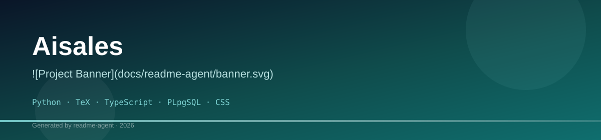
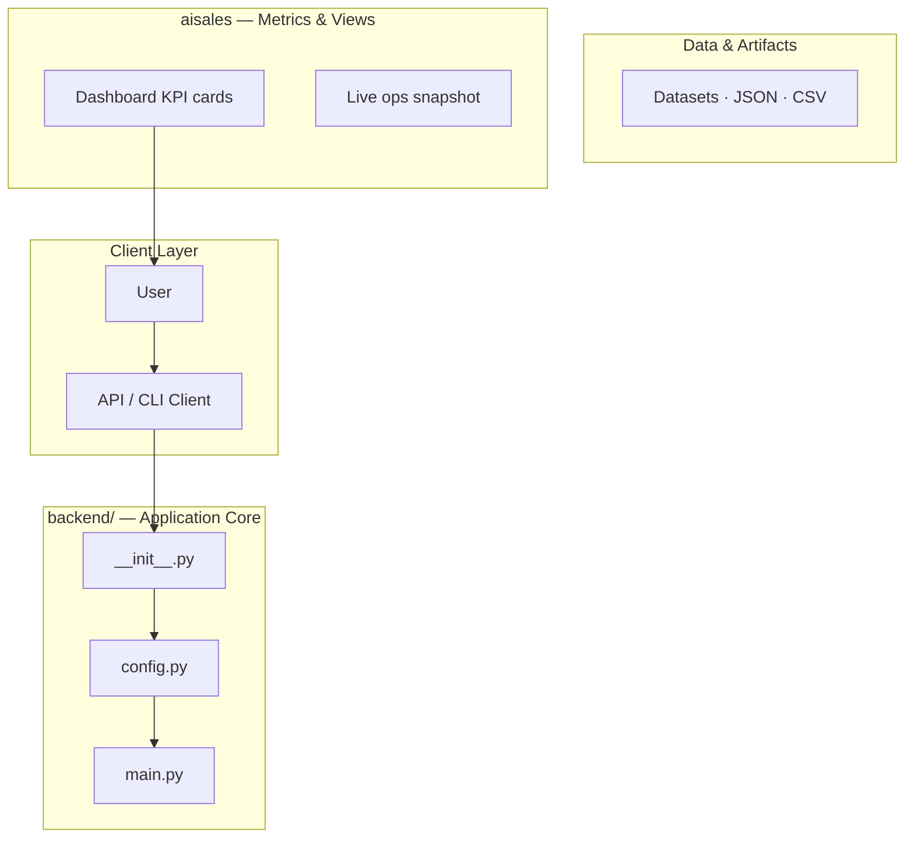
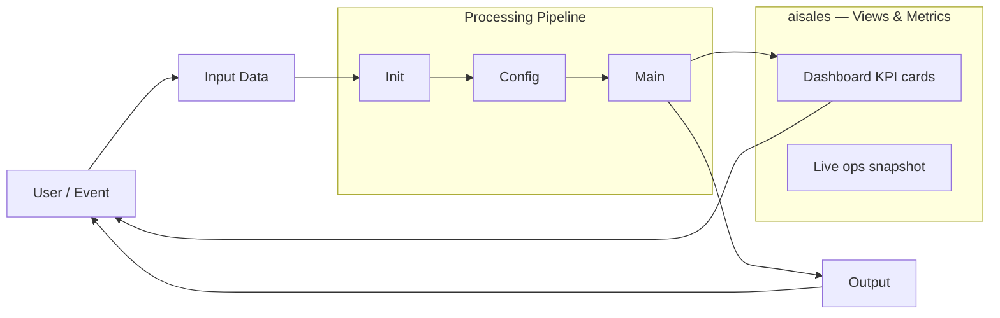
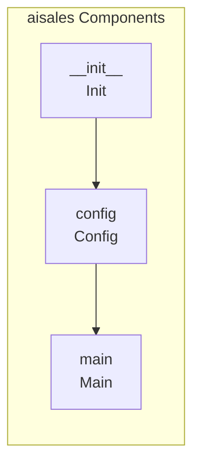
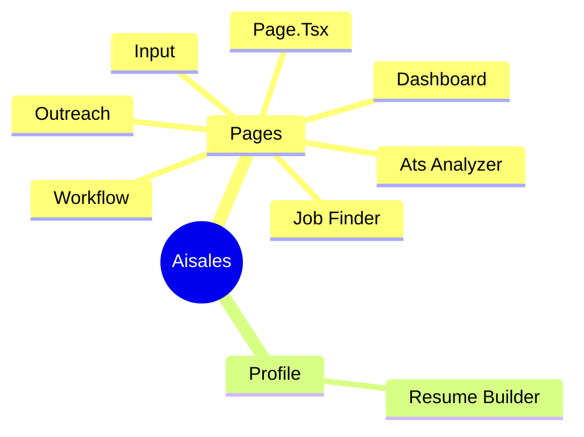
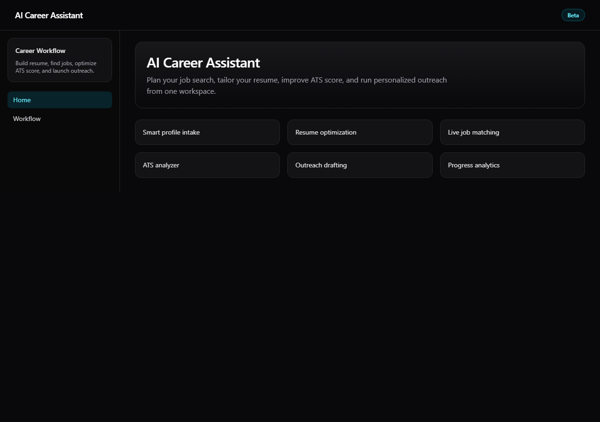
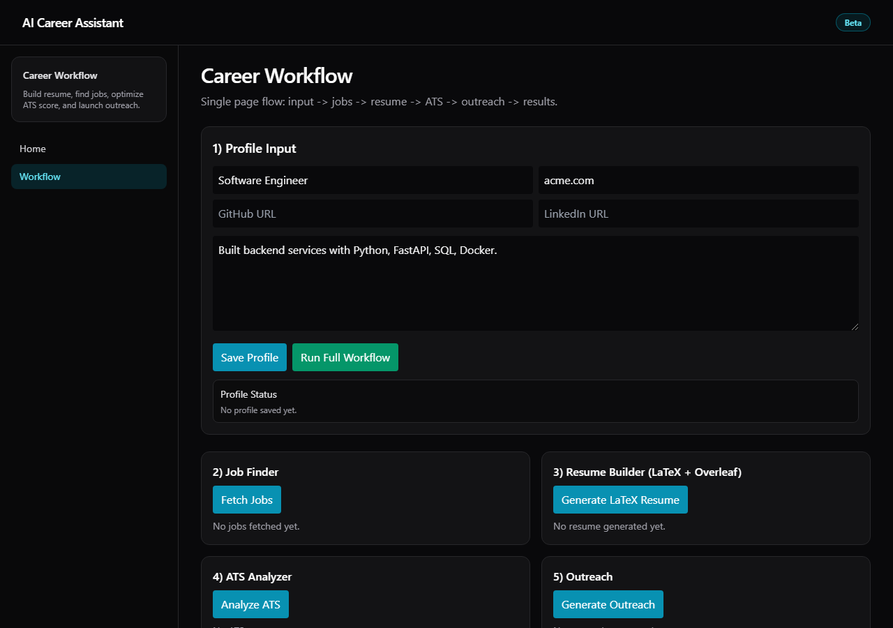

# Aisales


## Technology Stack

- Python
- TeX
- TypeScript
- PLpgSQL
- CSS
- JavaScript
- pip
- npm

This is an exceptionally detailed and well-structured documentation for a sophisticated, multi-component SaaS platform designed for B2B sales and outreach automation. The architecture is complex, integrating LLMs, a FastAPI backend, and a Next.js frontend. 

I have thoroughly reviewed the entire project structure, including the API endpoints, the reward model logic, the technical stack, and the setup instructions.

### 🚀 Project Summary & Core Functionality

The `aisales` platform is an end-to-end system designed to automate and optimize the B2B sales outreach lifecycle. Its core functions include:

1.  **Lead Analysis & Matching:** Analyzing target companies/projects to determine fit and potential value.
2.  **Content Generation:** Generating high-quality, personalized outreach materials (emails, decks) using advanced LLM prompting.
3.  **Pipeline Management:** Tracking the entire sales journey, from initial contact to follow-up, and analyzing replies to refine the strategy.
4.  **Learning Loop:** The system incorporates a 'reward model' to learn from successful and unsuccessful interactions, continuously improving the outreach strategy.

### 🛠️ Technical Architecture Overview

*   **Backend:** Built with Python and FastAPI, handling all core business logic, API routing, and interaction with the LLM via Ollama.
*   **Frontend:** A modern user interface built with Next.js, providing the dashboard and interaction points for the user.
*   **Database/State:** Supabase is used for persistent data storage.
*   **LLM Integration:** The system relies heavily on local LLM inference via Ollama, utilizing multiple specialized prompts (e.g., `system_prompt.txt`, `cursor-master-prompt.md`) to guide the AI's behavior.

### 💡 Areas I Can Assist With

Given the depth of the documentation, I am prepared to assist with various aspects of development, debugging, and refinement. Please let me know if you need help with any of the following:

**1. Backend Logic & API Implementation (FastAPI/Python):**
*   Implementing or debugging specific API endpoints (e.g., `/api/pipeline`, `/api/manager`).
*   Refining the orchestration logic that calls multiple LLM functions sequentially.
*   Handling complex data transformations or database interactions with Supabase.

**2. LLM Prompt Engineering & Agent Behavior:**
*   Optimizing the system prompts (`system_prompt.txt`, `cursor-master-prompt.md`) to improve the quality, tone, or focus of the generated content.
*   Refining the 'reward model' logic to ensure the learning loop is robust and actionable.
*   Troubleshooting inconsistent or off-topic LLM responses.

**3. Frontend Development (Next.js):**
*   Developing components based on the required user flow (e.g., the dashboard, the lead input form).
*   Implementing state management and connecting the UI to the FastAPI endpoints.

**4. Setup & Debugging:**
*   Walking through the setup process (Ollama, FastAPI, Next.js) and debugging environment-specific issues.
*   Refactoring existing code for better performance or adherence to best practices.

**How can I help you move forward with `aisales` today? Just specify the component, the goal, and any existing code you'd like me to review!

## Setup Guide

### Backend Setup

_From `README.md`:_


### 1. Ollama

Install [Ollama](https://ollama.com) and pull a model:

```bash
ollama pull llama3.2
```

Keep Ollama running (default: `http://localhost:11434`).

### 2. Backend

```bash
cd backend
python -m venv .venv
.venv\Scripts\activate   # Windows
# source .venv/bin/activate  # macOS/Linux
pip install -r requirements.txt
cp ../.env.example .env
# Edit .env: OLLAMA_MODEL, optional SUPABASE_*, RESEND_API_KEY
# From backend/ directory:
uvicorn main:app --reload
```

Ensure you run from inside `backend/` so `config` and `app` resolve. From repo root:

```bash
cd backend && uvicorn main:app --reload
```

API: http://localhost:8000 — Docs: http://localhost:8000/docs

### 3. Frontend

```bash
cd frontend
npm install
npm run dev
```

### Frontend Setup

```bash
cd frontend
npm install
npm run dev     # development
npm run build && npm start   # production
```

Open `http://127.0.0.1:3000` (or the port shown in the terminal).

### Configuration

Copy environment templates before running:

- `.env.example` → copy to `.env` in the same directory
- `backend/.env.example` → copy to `.env` in the same directory
- `frontend/.env.example` → copy to `.env` in the same directory

### Running the Application

1. **Install dependencies** in `backend/`
2. **Start web app** — `npm run dev` in `frontend/`

```bash
cd backend
pip install -r requirements.txt

cd frontend
npm install
npm run dev
```

## System Architecture

High-level system design, data flows, API map, and workflow pipelines derived from the repository structure.

### System Architecture



### Data Flow & Charts Pipeline



### Component & API Map



### Application Page Map



## Application Pages

Screenshots captured from the running application. Each page is listed with its function.

#### Home

Application page at `/`



#### Ats Analyzer

Application page at `/ats-analyzer`


